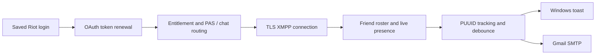

# Riot Client Notifier — Windows and Cloud Friend Alerts

[](#requirements) [](#installation) [](LICENSE)

**Riot Client Notifier** is a lightweight friend presence monitor with Windows desktop and Linux/cloud email profiles. It currently alerts when a friend comes online in **VALORANT**, even with Riot Client and VALORANT closed. The Node.js watcher connects to Riot's XMPP chat service, renews your saved remember-me login, and tracks friends by their stable PUUID.

Looking for a Riot Client friend notifier, a VALORANT online alert, or a Riot Games presence notification? This app alerts when a selected Riot friend enters VALORANT. Riot's wider game ecosystem also includes **League of Legends (LoL), Teamfight Tactics (TFT), Legends of Runeterra (LoR), League of Legends: Wild Rift, and 2XKO**. Those titles are included as Riot ecosystem keywords; this project's friend activity alerts currently detect VALORANT presence only. Read the [technical guide to Riot authentication and friend presence](TECHNICAL-GUIDE.md).

## Features

- Monitor multiple friends with separate Windows notifications, debounce, and cooldowns.
- Gmail email on the same VALORANT alert. A failed send retries on its own, without repeating the Windows toast.
- Standalone Riot XMPP presence connection; no running Riot Client required after login setup.
- Automatic token renewal from your existing saved Riot login.
- Stable PUUID tracking that survives Riot ID changes.
- Duplicate suppression, debounce, and saved notification state across restarts.
- Network/authentication failures handled as unknown rather than offline.
- Per-user Windows sign-in startup and simple start, stop, status, and friend-selection controls.
- Windows DPAPI encryption for the watcher's session cache; no passwords in configuration.
- Vendored streaming XML parser; no npm dependency installation required.

## Choose your environment

- **Windows desktop:** use the existing PowerShell installer below. It uses your saved Riot login, DPAPI, desktop notifications, and optional email.
- **Linux / cloud VM:** follow [CLOUD.md](CLOUD.md). It uses a securely exported encrypted session, email alerts, a separate data directory, and a systemd service.

Set `RIOT_ENV=windows` or `RIOT_ENV=cloud` explicitly, or let the OS select the default. Both profiles use the same monitoring code. GCloud deployment can be done separately.

## Windows requirements

- Windows with Windows PowerShell and desktop notification support.
- [Node.js](https://nodejs.org/en/download) 22 or newer available as `node` in your terminal.
- Riot Client installed and previously signed in with **remember me** enabled under the same Windows user.
- The friend you monitor must be an accepted friend of that Riot account.
- Internet connectivity; Windows must be signed in and the PC awake for desktop alerts.

This uses Riot's private authentication/social protocols. It was verified on a Windows installation; compatibility with every client version, account, or future authentication change is not guaranteed. It is an unofficial project, unaffiliated with Riot Games.

## Installation

Clone or download this repository, then run from its folder:

```powershell
git clone https://github.com/GodOfCoding1/riot-client-notifier.git
cd riot-client-notifier
powershell.exe -NoProfile -ExecutionPolicy Bypass -File .\install.ps1 -RiotId 'YourFriend#TAG,AnotherFriend#TAG'
```

Pass one Riot ID or a comma-separated list. Without `-RiotId`, the installer reuses the existing selection or prompts for IDs. It copies Node and the application into `%LOCALAPPDATA%\RiotFriendNotifier`, resolves all selected friends, runs checks, submits a test notification, enables sign-in startup, and starts the hidden watcher. No administrator account is required. Re-run the installer to upgrade an existing installation; existing single-friend configuration and notification state remain supported.

After setup, Riot Client and VALORANT can both be closed. If Riot revokes the saved authorization, sign into Riot Client again with remember me enabled. The watcher retries automatically.

## Select friends, start, stop, or check status

Open `%LOCALAPPDATA%\RiotFriendNotifier` and double-click:

| Control | Action |
| --- | --- |
| `ChangeFriends.cmd` / `ChangeFriend.cmd` | Replace the monitored list with one or more comma-separated Riot IDs |
| `AddFriend.cmd` | Add one or more Riot IDs, keeping existing friends |
| `RemoveFriend.cmd` | Remove one or more monitored Riot IDs; keep at least one friend |
| `Start.cmd` / `Stop.cmd` | Start or stop the background process |
| `Status.cmd` | Check running state, connection, latest observation, and startup |
| `Test.cmd` | Submit a Windows test notification |
| `DisableStartup.cmd` / `EnableStartup.cmd` | Remove or restore sign-in startup |

PowerShell example:

```powershell
$manager = Join-Path $env:LOCALAPPDATA 'RiotFriendNotifier\manage.ps1'
powershell.exe -NoProfile -ExecutionPolicy Bypass -File $manager -Action ChangeFriends -RiotId 'FriendOne#TAG,FriendTwo#TAG'
powershell.exe -NoProfile -ExecutionPolicy Bypass -File $manager -Action AddFriend -RiotId 'AnotherFriend#TAG'
powershell.exe -NoProfile -ExecutionPolicy Bypass -File $manager -Action RemoveFriend -RiotId 'FriendOne#TAG'
powershell.exe -NoProfile -ExecutionPolicy Bypass -File $manager -Action Status
```

Stop does not disable future sign-in startup. DisableStartup does not stop the currently running process. Use both to disable the application completely.

Friend changes take effect on the next poll. Duplicate PUUIDs are monitored once. If any ID cannot be resolved, the existing selection is preserved. Adding or removing friends preserves alert state for friends that remain selected. Removal uses the stored display ID, without needing a Riot connection.

## How it works



Presence events update a local cache shared by all friends over one XMPP connection; the watcher evaluates it every 12 seconds. Each friend has independent debounce, cooldown, and saved notification state. Entering VALORANT requires two healthy observations at least 12 seconds apart. Leaving requires 36 seconds of healthy non-VALORANT presence; a two-minute cooldown further suppresses repeats. A first confirmed already-online observation can notify once, and persisted state prevents repeat alerts on reconnects.

Concurrent launcher/mobile and VALORANT sessions are tracked separately. `dnd` can mean in-game activity and counts as online. Disconnected or stale streams are unknown, never treated as a confirmed offline transition. Very short visits or transitions during outages may be missed.

The watcher publishes normal Riot chat presence to subscribe to friend updates, so **your account may appear online in Riot chat**. It sends no chat messages, friend requests, or gameplay commands.

## Credentials and privacy

| File | Purpose |
| --- | --- |
| `%LOCALAPPDATA%\Riot Games\Riot Client\Data\RiotGamesPrivateSettings.yaml` | Existing Riot saved authorization, read without modification |
| `%LOCALAPPDATA%\RiotFriendNotifier\session.dpapi` | Refreshed watcher session encrypted for the Windows user |
| `config.json` | `friends` array of Riot IDs/PUUIDs and mode; no login secrets |
| `.env` | Gmail SMTP app password, sender, and recipient. Git ignores this file. |
| `state.json` | Notification deduplication state keyed by each friend's PUUID |
| `status.json` / `watcher.log` | Sanitized health and delivery diagnostics |

Riot passwords and browser cookies are not requested. The Gmail app password stays in `.env`. Remote HTTPS/TLS verifies certificates. The optional older loopback implementation confines its certificate exception to `127.0.0.1`.

Never commit saved Riot settings, decrypted tokens, encrypted session caches, cookies, or logs. See [SECURITY.md](SECURITY.md) for credential handling and report guidance.

## Verify that monitoring is healthy

Status should show `Running: True`, `source: independent-xmpp`, `chatConnected: true`, and a timestamp that advances. Its `friends` array reports each friend's ID, PUUID, `observed`, and `stable` status. `observed: other` means a healthy non-VALORANT result; persistent `unknown` means activity cannot currently be determined. Short loading/renewal periods are expected.

`Test.cmd` submits a Windows test notification and, when `.env` is present, a test email. It does not check Riot connectivity or an actual friend transition. Check notification settings and Do Not Disturb if a banner does not appear.

```powershell
node .\tests.cjs
node .\xmpp-tests.cjs
node .\multi-friend-tests.cjs
node .\notify-tests.cjs
node .\cloud-tests.cjs
```

The project has 61 transition, protocol, health, encryption, multi-friend, email-delivery, and runtime checks on Windows (59 on Linux), including Windows management command integration. Read the [verification record](verification.md) for the distinction between live evidence and simulated checks. Cloud process recovery is handled by systemd; Windows process exits require Start or a new sign-in.

## Raspberry Pi, Linux, and cloud servers

Linux and cloud VMs are supported by the cloud runtime profile. See [CLOUD.md](CLOUD.md) for session export, email configuration, friend selection, persistent state, and service installation. Windows DPAPI caches cannot be transferred to Linux. Cloud authentication and live alert delivery must be verified on the destination VM.

The configured GCloud deployment includes independent failure and recovery email alerts. See [monitoring health](deploy/HEALTH.md) for how stale checks, unknown friend status, stopped processes, and VM outages are detected.

## Documentation and development

- [Technical guide](TECHNICAL-GUIDE.md): live protocol discovery, OAuth refresh, XMPP authentication, friend roster, health checks, and migration.
- [Verification record](verification.md): observed results, simulations, and untested scenarios.
- [Contributing](CONTRIBUTING.md): setup, checks, and contribution expectations.
- [Security](SECURITY.md): protecting authorization and reporting vulnerabilities.
- [Third-party notices](THIRD-PARTY-NOTICES.md): vendored XML parser attribution.

## Uninstall

Run `Stop.cmd`, then `DisableStartup.cmd`. Delete `%LOCALAPPDATA%\RiotFriendNotifier`, including its encrypted session cache. Optionally remove the sender registry key `HKCU\Software\Classes\AppUserModelId\Local.RiotFriendNotifier`.

## License and references

Project code is [MIT licensed](LICENSE). The vendored sax parser retains its own license. VALORANT and Riot Games names are used to describe compatibility and remain their respective owners' trademarks.

Protocol references: [Riot OpenID metadata](https://auth.riotgames.com/.well-known/openid-configuration), [VALORANT XMPP documentation](https://valapidocs.techchrism.me/endpoint/xmpp-connection), and [techchrism's XMPP watcher](https://github.com/techchrism/valorant-xmpp-watcher).
